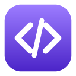
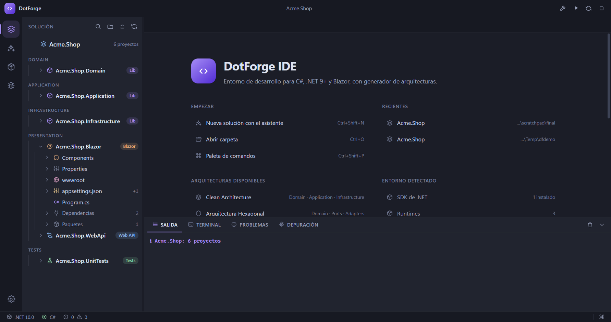
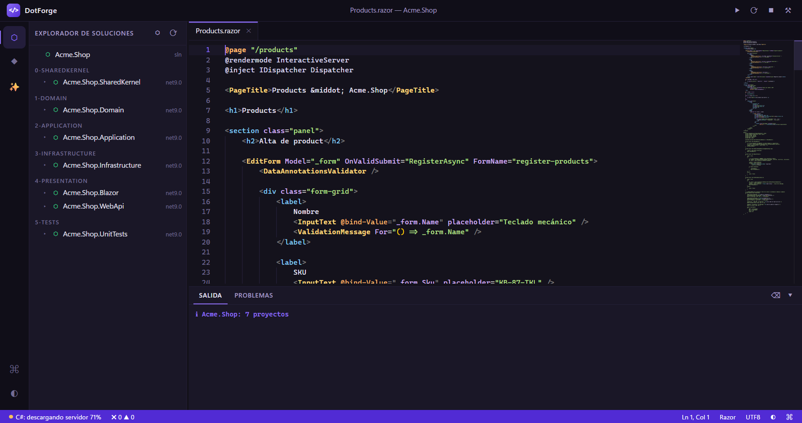
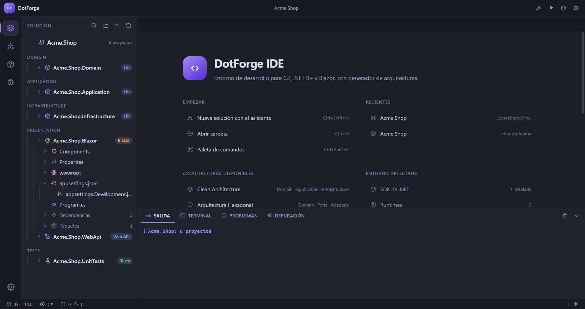

<div align="center">



# DotForge IDE

**Entorno de desarrollo de escritorio para C#, .NET 9+ y Blazor, con generador de arquitecturas de software.**

Windows · macOS · 100% open source

</div>

---

## Qué es

DotForge IDE es una distribución de IDE construida sobre **Electron + Monaco Editor** y pensada
específicamente para el flujo de trabajo de un desarrollador .NET: abrir una solución, entender su
estructura, escribir C# y Razor con IntelliSense, compilar, ejecutar, depurar y gestionar paquetes
NuGet sin salir de la ventana.

Su módulo diferencial es el **asistente de arquitecturas**: genera soluciones .NET completas —
Clean Architecture, Hexagonal o DDD + CQRS — que **compilan, pasan sus pruebas y se ejecutan**
desde el primer minuto, con un CRUD funcional de ejemplo.



---

## Índice

- [Características](#características)
- [Instalación](#instalación)
- [El generador de arquitecturas](#el-generador-de-arquitecturas)
  - [Clean Architecture](#clean-architecture)
  - [Arquitectura Hexagonal](#arquitectura-hexagonal)
  - [DDD + CQRS](#ddd--cqrs)
  - [Opciones del generador](#opciones-del-generador)
  - [Uso desde la línea de comandos](#uso-desde-la-línea-de-comandos)
- [Atajos de teclado](#atajos-de-teclado)
- [Arquitectura interna del IDE](#arquitectura-interna-del-ide)
- [Compilar y empaquetar](#compilar-y-empaquetar)
- [Pruebas](#pruebas)
- [Componentes open source](#componentes-open-source)
- [Limitaciones conocidas](#limitaciones-conocidas)
- [Documentación del proyecto](#documentación-del-proyecto)

---

## Características

### Generador de arquitecturas

- Tres arquitecturas de referencia listas para producción: **Clean**, **Hexagonal** y **DDD + CQRS**.
- Asistente visual de tres pasos y CLI equivalente (`dotforge`), sobre el **mismo motor**.
- Cada solución generada incluye CRUD funcional, Web API minimal con OpenAPI, UI Blazor
  interactiva, pruebas unitarias, logging estructurado y persistencia configurada.
- Solución reproducible: los GUID del `.sln` son deterministas, así que regenerar produce el mismo
  archivo y los diffs son limpios.

### Editor

- **Monaco Editor** con IntelliSense de C# vía **Roslyn LanguageServer** (con OmniSharp de respaldo):
  completado, hover, ayuda de firma, ir a la definición, buscar referencias, renombrar, formatear
  y diagnósticos en vivo.
- Gramática **Razor/Blazor** propia: distingue directivas (`@page`, `@code`), bloques de control
  (`@foreach`, `@if`), C# incrustado, componentes Blazor y etiquetas HTML.
- Auto-cierre de etiquetas que respeta las void (`<br>`) y las autocerradas (`<Foo />`).
- 13 snippets de Blazor (`@page`, `@code`, `EditForm`, `@bind`, `[Parameter]`, …).
- Pestañas con estado de scroll y cursor por archivo, y aviso de cambios sin guardar.



### Soluciones .NET

- **Explorador de soluciones** que lee `.sln`, `.slnx` y `.csproj` SDK-style, con carpetas de
  solución, referencias de proyecto y de paquete, y target framework heredado de
  `Directory.Build.props`.
- Cada proyecto lleva una **insignia** con lo que realmente es —Blazor, Web API, librería, pruebas,
  worker— deducida del SDK y del contenido, no del nombre.
- **Anidamiento de archivos**: `Home.razor.cs` y `Home.razor.css` cuelgan de `Home.razor`, y
  `appsettings.Development.json` de `appsettings.json`. Agrupa, nunca oculta: si el archivo padre
  no existe, el hijo se queda a la vista.
- **Guías de sangría** que resaltan el nivel activo, para que una jerarquía Clean o DDD siga
  siendo legible siete niveles adentro.
- `bin`, `obj`, `.vs`, `.git` y `node_modules` están ocultos por defecto.
- Filtro por nombre y "contraer todo" en la cabecera del panel.
- Vista alternativa de archivos para lo que no pertenece a ningún proyecto.
- Menú contextual por proyecto: compilar, ejecutar, hot reload, pruebas, paquetes.



### Compilación y ejecución

- **Selector de inicio en la barra superior**, al estilo de Visual Studio y Rider: qué proyecto se
  arranca, con qué modo y el botón de Play, siempre a la vista.
- **Perfiles multiproyecto**: marca varios proyectos, ordénalos y guarda el conjunto con nombre
  ("Backend + Web"). Se guardan por solución, fuera del repositorio.
- Dos modos claros: **Depurar** (F5), que engancha NetCoreDbg y aplica `launchSettings.json`, y
  **Sin depurar** (Ctrl+F5), que arranca las webs con Hot Reload.
- **Un canal de salida por proceso**: cada proyecto arrancado tiene su pestaña con su nombre, su
  estado y el puerto en el que escucha, clicable para abrirlo en el navegador.
- Tareas de `dotnet`: `build`, `rebuild`, `clean`, `restore`, `test`, `run` y `watch`.
- La salida de MSBuild se convierte en **diagnósticos clicables** que llevan a la línea exacta, y
  se pintan como marcadores en el editor.
- **Hot Reload** con `dotnet watch`, con detección de la URL en la que queda escuchando la app.
- Terminal integrada para `dotnet`, `git`, `npm` y compañía, con historial y **autocompletado
  contextual**: subcomandos de git y de la CLI de .NET, **ramas reales del repositorio** tras
  `git checkout` o `git switch`, proyectos de la solución tras `--project` y paquetes NuGet
  habituales tras `dotnet add package`. Se acepta con `Tab` o con la flecha derecha.

### Depuración

- **NetCoreDbg** (MIT) hablando Debug Adapter Protocol.
- Breakpoints en el margen del editor, pila de llamadas, variables expandibles, evaluación de
  expresiones y controles de paso (F5 / F9 / F10 / F11).

### Paquetes NuGet

- Panel visual: buscar en nuget.org, ver lo instalado, elegir versión, instalar y desinstalar.
- Los iconos de los paquetes se dibujan localmente: el panel no revela a terceros qué estás mirando.

### Producto

- Tema **DotForge Purple** (oscuro) y variante clara, con contraste AA. Tonos apagados, sin negros
  ni blancos puros: el fondo más oscuro es `#1b1d27` y el texto más claro `#c8cee2`, pensado para
  sesiones largas.
- **61 iconos vectoriales propios** en una sola rejilla, incluidas las marcas del ecosistema (C#,
  Razor, solución, proyecto) y de las carpetas con significado: `Controllers`, `Models`,
  `Services`, `Pages`, `Components`, `Domain`, `Ports`, `wwwroot`…
- Barra de actividad reducida a cinco herramientas y barra de estado con lo imprescindible: SDK
  activo, estado del servidor de lenguaje, rama de Git y errores.
- **Ajustes** en la barra lateral, con efecto inmediato: tema, tamaño de fuente, tabulación,
  minimapa, ajuste de línea, formateo al guardar e IntelliSense.
- Iconografía multirresolución propia: `.ico` (7 tamaños), `.icns` (11 entradas), PNG de 16 a 1024.
- Paleta de comandos con todo lo que hace el IDE, buscable por teclado.
- Atajos compatibles con Windows y macOS.

---

## Instalación

### Usuarios

Descarga el artefacto de tu plataforma desde `dist/` o desde los artefactos del workflow de CI:

| Plataforma | Artefacto | Notas |
|---|---|---|
| Windows | `DotForge IDE-1.3.1-Setup-x64.exe` | Instalador NSIS; permite elegir carpeta |
| Windows | `DotForge IDE-1.3.1-win-x64.zip` | Portable, sin instalación |
| macOS | `DotForge IDE-1.3.1-arm64.dmg` | Apple Silicon |
| macOS | `DotForge IDE-1.3.1-x64.dmg` | Intel |

> Los artefactos no están firmados: Windows mostrará el aviso de SmartScreen y macOS pedirá
> confirmación en Gatekeeper. Es lo esperado sin certificado de desarrollador.

**Requisito:** el [SDK de .NET](https://dotnet.microsoft.com/download) 9 o 10 en el `PATH`. Sin él,
DotForge funciona como editor pero no puede compilar, ejecutar ni depurar; la pantalla de
bienvenida lo indica.

La primera vez que abres una solución, DotForge descarga el servidor de lenguaje (~90 MB) y, al
depurar por primera vez, NetCoreDbg. Ambos quedan cacheados. Para pre-descargarlos:

```bash
npm run fetch:toolchain
```

### Desarrolladores

```bash
npm install
npm run build
npm start
```

Abrir una carpeta o un archivo directamente:

```bash
npx electron . /ruta/a/mi/solucion
```

---

## El generador de arquitecturas

Abre el asistente con **Ctrl/Cmd+Shift+N**, o desde la pantalla de bienvenida, o con el icono ✨ de
la barra de actividad.

### Clean Architecture

Cuatro capas concéntricas con la regla de dependencia apuntando hacia dentro.

```
Acme.Shop/
├── src/
│   ├── Acme.Shop.Domain/            # Entidades, objetos de valor, invariantes. Sin dependencias.
│   ├── Acme.Shop.Application/       # Casos de uso + puertos (repositorio, reloj, unidad de trabajo)
│   ├── Acme.Shop.Infrastructure/    # EF Core, repositorios, reloj del sistema
│   ├── Acme.Shop.WebApi/            # Minimal API + OpenAPI + Scalar
│   └── Acme.Shop.Blazor/            # Blazor interactivo en servidor
└── tests/
    └── Acme.Shop.UnitTests/         # xUnit con dobles en memoria
```

**Qué demuestra:** que el dominio no referencia infraestructura (verificado por los tests), el
patrón `Result` en lugar de excepciones para el flujo esperado, y un objeto de valor `Money`
mapeado como *owned type* de EF Core.

### Arquitectura Hexagonal

Puertos y adaptadores: el núcleo no sabe quién lo llama ni quién le responde.

```
Acme.Iot/
├── src/
│   ├── Acme.Iot.Domain/                    # Núcleo puro
│   ├── Acme.Iot.Ports/                     # Inbound/ (casos de uso) + Outbound/ (repos, avisos, reloj)
│   │                                       # + Application/ (servicios que implementan los de entrada)
│   ├── Acme.Iot.Adapters.Persistence/      # Adaptador conducido: EF Core
│   ├── Acme.Iot.Adapters.Notifications/    # Adaptador conducido no persistente
│   ├── Acme.Iot.Adapters.Web/              # Adaptador conductor: HTTP
│   └── Acme.Iot.Adapters.Blazor/           # Adaptador conductor: UI
└── tests/
    └── Acme.Iot.UnitTests/                 # Ejercita el hexágono con adaptadores dobles
```

**Qué demuestra:** que se puede probar el sistema completo sin base de datos ni servidor web, y que
cambiar de persistencia es escribir otro adaptador. El puerto de notificaciones existe para dejar
claro que un puerto de salida no es sinónimo de base de datos.

> **Nota de diseño:** los servicios de aplicación viven en el proyecto `Ports` para mantener
> exactamente los tres anillos del patrón. Si prefieres separarlos, extrae `Application/` a su
> propio proyecto: no hay que tocar ni el dominio ni los adaptadores.

### DDD + CQRS

La solución más completa: DDD táctico con comandos y consultas separados.

```
Acme.Billing/
├── src/
│   ├── Acme.Billing.SharedKernel/     # Entity, AggregateRoot, ValueObject, IDomainEvent, Result
│   ├── Acme.Billing.Domain/           # Agregado Invoice + VOs (Sku, Money) + eventos de dominio
│   ├── Acme.Billing.Application/      # Commands/, Queries/, EventHandlers/, Dispatcher, Behaviors
│   ├── Acme.Billing.Infrastructure/   # EF Core + repositorio del agregado + publicación de eventos
│   ├── Acme.Billing.WebApi/
│   └── Acme.Billing.Blazor/
└── tests/
    └── Acme.Billing.UnitTests/
```

**Qué demuestra:**

- Un **agregado** con invariantes protegidas: sin setters públicos, todo cambio pasa por métodos
  con nombre de negocio que además registran el evento correspondiente.
- **Objetos de valor** con igualdad estructural (`Sku`, `Money`).
- **Eventos de dominio** que se publican **después** de confirmar la transacción, nunca antes: si
  el guardado falla, esos hechos no ocurrieron.
- **CQRS sin MediatR**: un `IDispatcher` propio de ~150 líneas con envoltorios genéricos cacheados
  y pipeline de comportamientos (logging + validación). Cero fricción de licencia.
- Registro de handlers **por reflexión**: añadir un caso de uso es añadir una clase.

### Opciones del generador

| Opción | Valores | Por defecto | Efecto |
|---|---|---|---|
| Arquitectura | `clean`, `hexagonal`, `ddd` | — | Estructura de la solución |
| Nombre | identificador con puntos | `Acme.Shop` | Prefijo de todos los proyectos |
| Entidad | PascalCase singular | `Product` | Entidad del CRUD de ejemplo (se pluraliza sola) |
| Presentación | `webapi`, `blazor`, `both` | `both` | Qué proyectos de UI se generan |
| Framework | `net9.0`, `net10.0` | `net9.0` | Target y versiones de paquetes |
| Persistencia | `sqlite`, `inmemory` | `sqlite` | Proveedor de EF Core |
| Pruebas | sí / no | sí | Proyecto xUnit |
| Git | sí / no | no | `git init` + commit inicial |

Todo lo generado usa **Central Package Management**: las versiones se declaran una sola vez en
`Directory.Packages.props`.

### Uso desde la línea de comandos

La CLI usa el mismo motor que el asistente visual, así que sirve para CI y scripts:

```bash
node build/cli.js new clean --name Acme.Shop --output ./workspace
```

```bash
node build/cli.js list
```

```bash
node build/cli.js new ddd --name Acme.Billing --entity Invoice --ui webapi --framework net10.0
```

Flags: `--ui`, `--framework`, `--db`, `--entity`, `--no-tests`, `--git`, `--force`, `--json`.

Con `--json` emite el resultado completo (proyectos, archivos, siguientes pasos) para consumirlo
desde otra herramienta.

**Después de generar:**

```bash
cd Acme.Shop && dotnet build && dotnet test
```

---

## Atajos de teclado

En macOS, `Ctrl` es `Cmd`.

| Acción | Atajo |
|---|---|
| Nueva solución con el asistente | `Ctrl+Shift+N` |
| Abrir carpeta | `Ctrl+O` |
| Guardar / Guardar todo | `Ctrl+S` / `Ctrl+Alt+S` |
| Paleta de comandos | `Ctrl+Shift+P` |
| Explorador de soluciones | `Ctrl+Shift+E` |
| Paquetes NuGet | `Ctrl+Shift+U` |
| Problemas | `Ctrl+Shift+M` |
| Terminal | `Ctrl+J` |
| **Compilar solución** | `Ctrl+Shift+B` |
| Recompilar todo | `Ctrl+Alt+B` |
| Ejecutar pruebas | `Ctrl+Shift+T` |
| **Iniciar depuración** | `F5` |
| Hot Reload (`dotnet watch`) | `Ctrl+F5` |
| Detener | `Shift+F5` |
| Alternar breakpoint | `F9` |
| Paso a paso por procedimientos / instrucciones | `F10` / `F11` |
| Salir del método | `Shift+F11` |
| Ir a la definición | `F12` |
| Renombrar símbolo | `F2` |
| Buscar en el archivo | `Ctrl+F` |
| Formatear documento | `Alt+Shift+F` |

---

## Arquitectura interna del IDE

```
src/
├── shared/        Contratos IPC y tipos compartidos (sin dependencias de Node ni Electron)
├── scaffold/      ★ Generador de arquitecturas — Node puro, sin Electron
│   ├── engine.ts      Motor de plantillas estricto: {{token}}, {{#if}}, {{else}}
│   ├── generator.ts   Recorrido, render y escritura
│   ├── blueprints/    Definición de cada arquitectura
│   └── templates/     Archivos .tmpl (C#, .csproj, .razor, .json)
├── cli/           CLI `dotforge`, headless
├── main/          Proceso principal de Electron
│   ├── ipc/           Única superficie expuesta al renderer
│   ├── services/      .sln/.csproj, NuGet, tareas MSBuild, terminal, rutas, ZIP
│   ├── lsp/           Adquisición y cliente del servidor de lenguaje
│   └── debug/         Adquisición de NetCoreDbg y bridge DAP
└── renderer/      UI
    ├── languages/     Gramática Razor y auto-cierre de etiquetas
    ├── views/         Explorador, editor, NuGet, panel, wizard, paleta, depuración
    └── styles/        Tokens de tema y componentes
```

**Decisiones que explican la forma del código:**

- **Electron + Monaco en vez de un fork de VS Code o Theia.** El árbol se compila en menos de un
  segundo, la superficie de seguridad es pequeña y auditable, y los artefactos son ligeros. El
  precio es implementar a mano el cliente LSP, el bridge DAP y los paneles — que es justo el
  trabajo diferencial del producto.
- **`src/scaffold/` no importa `electron`.** Así el generador se prueba con Node puro, sin display,
  y la CLI y el asistente comparten exactamente el mismo código.
- **Cero dependencias nativas.** No hay `node-pty` ni módulos que requieran recompilación: el
  empaquetado es reproducible y no hay paso de rebuild en la máquina del usuario. El precio es que
  la terminal no tiene pseudoterminal.
- **El renderer es territorio hostil.** `contextIsolation` activado, sin `nodeIntegration`, sin
  `ipcRenderer` expuesto, CSP sin `eval` ni orígenes remotos, y toda ruta que llega del renderer se
  valida contra el workspace abierto.

---

## Compilar y empaquetar

```bash
npm run build
```

| Comando | Qué hace |
|---|---|
| `npm run build` | Compila main, preload, renderer, CLI y bundles auxiliares con esbuild |
| `npm run watch` | Igual, en modo watch |
| `npm run dev` | Build + Electron con DevTools |
| `npm start` | Electron sobre el último build |
| `npm run icons` | Regenera `.ico`, `.icns` y los PNG desde el logo dibujado por código |
| `npm run pack` | Empaqueta sin instalador (carpeta desempaquetada) |
| `npm run dist:win` | **Windows:** instalador NSIS + portable ZIP → `dist/` |
| `npm run dist:mac` | **macOS:** `.dmg` + `.app` comprimido, arm64 y x64 → `dist/` |
| `npm run verify:dist` | Comprueba qué artefactos hay en `dist/`, su tamaño y su firma |
| `npm run prune:dist` | Borra de `dist/` los artefactos de versiones anteriores (`--dry-run` sólo informa) |
| `npm run clean` | Borra `build/` y `dist/` (`--all` incluye el toolchain cacheado) |

### macOS

`npm run dist:mac` **sólo funciona en macOS o Linux**: el `.dmg` necesita herramientas que sólo
existen en macOS (`hdiutil`, `codesign`). Ejecutarlo en Windows imprime una explicación y sale con
código 2 en lugar de dejar un `dist/` a medias.

La ruta oficial para obtener los artefactos de macOS es el workflow incluido
[`.github/workflows/release.yml`](.github/workflows/release.yml), que compila en un runner
`macos-latest` y publica arm64 y x64.

### Firma

No hay certificados en el repositorio. Para firmar:

- **Windows:** define `CSC_LINK` y `CSC_KEY_PASSWORD` con tu certificado `.pfx`.
- **macOS:** define `CSC_NAME` con tu Developer ID y activa `hardenedRuntime` en
  `electron-builder.yml`; para notarizar, añade `APPLE_ID`, `APPLE_APP_SPECIFIC_PASSWORD` y `TEAM_ID`.

---

## Pruebas

```bash
npm test
```

**359 pruebas** en cuatro grupos:

| Grupo | Qué verifica |
|---|---|
| `unit` | Motor de plantillas, nombres y pluralización, invariantes de los blueprints, emisor de `.sln`, parseo de `.sln`/`.csproj`, diagnósticos de MSBuild, auto-cierre de etiquetas, reglas del árbol (anidamiento, iconos, insignias) y geometría de los iconos |
| `security` | Path traversal, superficie del preload, configuración de Electron, CSP, ausencia de `shell:true`, troceado de comandos de la terminal |
| `package` | Configuración de empaquetado, árbol de `build/`, validez real de `.ico` y `.icns`, arranque de Electron y tokenización de Razor dentro del renderer |
| `scaffold` | Genera 6 combinaciones de arquitectura y opciones, ejecuta **`dotnet build` de verdad** exigiendo 0 errores y 0 advertencias, ejecuta `dotnet test`, arranca la Web API generada y ejercita el CRUD por HTTP, y depura un programa real parando en un breakpoint |

Grupos sueltos: `npm run test:unit`, `npm run test:scaffold`, `npm run test:package`.

Variables para CI: `DOTFORGE_SKIP_DOTNET=1` y `DOTFORGE_SKIP_ELECTRON=1` saltan lo que requiere SDK
o display. `DOTFORGE_KEEP_OUTPUT=1` conserva las soluciones generadas para inspeccionarlas.

**Nada se mockea donde importa:** el grupo `scaffold` invoca el SDK de .NET real. Un generador de
soluciones .NET que nunca se comprueba contra el SDK no está probado.

---

## Componentes open source

| Componente | Licencia | Uso |
|---|---|---|
| [Electron](https://electronjs.org) | MIT | Shell de escritorio |
| [Monaco Editor](https://microsoft.github.io/monaco-editor/) | MIT | Editor de código |
| [Roslyn LanguageServer](https://github.com/dotnet/roslyn) | MIT | IntelliSense de C# |
| [OmniSharp-Roslyn](https://github.com/OmniSharp/omnisharp-roslyn) | MIT | Servidor de respaldo |
| [NetCoreDbg](https://github.com/Samsung/netcoredbg) | MIT | Depurador .NET |
| [esbuild](https://esbuild.github.io) | MIT | Compilación |
| [electron-builder](https://www.electron.build) | MIT | Empaquetado |
| [fast-xml-parser](https://github.com/NaturalIntelligence/fast-xml-parser) | MIT | Parseo de `.csproj` |
| [Open VSX](https://open-vsx.org) | EPL-2.0 | Registro de extensiones de referencia |

Sin componentes del VS Code Marketplace ni binarios propietarios del C# Dev Kit.

En las soluciones **generadas**: EF Core, Serilog, Scalar y xUnit, todos con licencias permisivas.
**MediatR queda deliberadamente fuera** por su cambio a licencia comercial; el despachador CQRS es
propio.

---

## Limitaciones conocidas

Se listan explícitamente porque un README que sólo cuenta lo que funciona no sirve para decidir.

- **La terminal no es un pseudoterminal.** Ejecuta comandos y muestra su salida; los programas
  interactivos (REPL, `vim`) no funcionarán. Es la consecuencia directa de no usar `node-pty`, que
  es una dependencia nativa. Los programas admitidos están en una lista blanca corta y auditable.
- **`dist:mac` requiere macOS o Linux.** Limitación de electron-builder, no de este proyecto.
- **Artefactos sin firmar.** No hay certificados; ver [Firma](#firma).
- **NetCoreDbg en macOS Intel** depende de que la release publique `netcoredbg-osx-amd64.zip`; la
  última release sólo publica arm64. El IDE lo detecta y lo dice, en vez de fallar de forma opaca.
- **Sin extensiones VSIX.** El registro apunta a Open VSX como base para una versión futura, pero
  el host de extensiones no está implementado.
- **Las plantillas usan xUnit v2 + VSTest**, no xUnit v3 + Microsoft.Testing.Platform: el SDK 10 y
  el orquestador MTP todavía no encajan bien (ver ADR-003 en `PROJECT_DEVLOG.md`).
- **`net9.0` compila pero necesita el runtime 9 para ejecutarse.** Si sólo tienes el runtime 10,
  genera con `--framework net10.0`.

---

## Documentación del proyecto

| Archivo | Para qué sirve |
|---|---|
| [`CLAUDE.md`](CLAUDE.md) | Documento maestro: comandos, layout, convenciones y trampas del entorno |
| [`AGENTS.md`](AGENTS.md) | Equipo virtual de 10 sub-agentes especializados, con rol, prompt y criterio de aceptación |
| [`PROJECT_DEVLOG.md`](PROJECT_DEVLOG.md) | Roadmap por fases, decisiones técnicas (ADR) y bitácora de errores con su causa raíz |

---

<div align="center">

**DotForge IDE** · MIT · Hecho para gente que escribe C#

</div>
